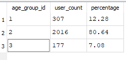

# Pre-validation: Netflix as Proxy Model for Youtube Churn Analysis
## Exclusive Summary
**Data Limitation & Hypothesis Adjustment**
- Due to Kaggle Netflix dataset limitations (Age 18-51 years ONLY, no 65+ Representation),
  I have adjusted my analytical scope
- This analysis focuses on **Users aged 18-49 years**, representing 92.92% of the Netflix dataset

  
## 1. Proble Statement
- Youtube churn data not publicly available
- Need validated proxy model
- solution: Netflix Kaggle dataset

## 2. Validation Approach
### Sources
- https://www.pewresearch.org/short-reads/2025/07/01/83-of-us-adults-use-streaming-services-far-fewer-subscribe-to-cable-or-satellite-tv/
- https://www.pewresearch.org/internet/2025/11/20/americans-social-media-use-2025/pi_2025-11-20_social-media-use_0-04/
- https://www.lendingtree.com/credit-cards/study/streaming-services-report/
- https://www.lendingtree.com/credit-cards/study/americans-have-an-online-subscription-and-video-streaming-is-king/

## 3. Data Processing & Cleaning (SQL Normalization with Netflix Userbase)
- SQL Normalization
- Data Quality Assessment
- Demographic Distribution Analysis
  
## 4. Validation Methodology
- Gender spending pattern
- Age group distribution

## 5. Conclusion
## 6. Next steps
